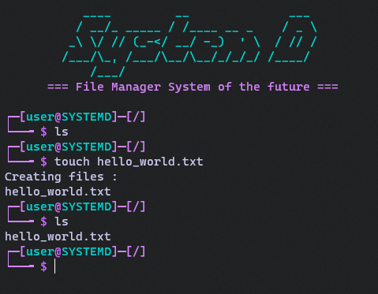

# SystemD

A basic File Manager System implemented in C, accessible throught a cusom shell interpreter. [School Project]

<center>

</center>

## Compile and execute

```
make && ./systemd
```

## Examples
```
touch file
mkdir dir
cd dir
cd ..
rmdir dir
rm file
pwd
df
ls
```

## Abstract

1) ### The Shell
   
   We use a hashmap  to associate commands name to it's function pointer.
   
   Implemented commands and features: 
   
   - Linux-like :
   
           `cp ; rm ; mv ; cat ; ln ; echo ; > ; ls ; mkdir ; rmdir ; cd` & minimal `find; grep`
   
   - `df` to get infos on the virtual FS drive
   
   - metadatas
   
   - access privieleges
   
   - multi-users
     
     

2) ### The File System
   
       


### TODO

- open / close with permissions (two flags left: O\_TRUNC and O\_APPEND)

